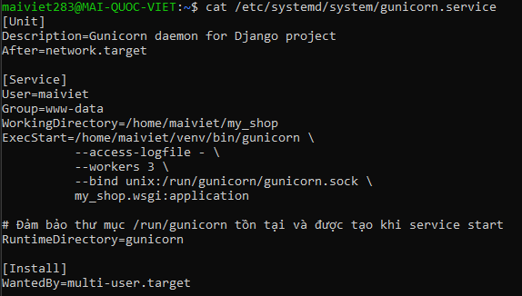

Ok, mình sẽ giải thích chi tiết từng phần trong file `gunicorn.service` của bạn, vì đây là **key để chạy Django production bằng Gunicorn**.

---



## **1️⃣ \[Unit]**

```ini
[Unit]
Description=Gunicorn daemon for Django project
After=network.target
```

* `Description`: Mô tả ngắn gọn về service, ở đây là “Gunicorn daemon for Django project”.
* `After=network.target`: đảm bảo service **chỉ khởi động sau khi network đã sẵn sàng**. Nếu không có network, Gunicorn sẽ khởi động trước Nginx hoặc các service khác thì có thể fail.

---

## **2️⃣ \[Service]**

```ini
[Service]
User=maiviet
Group=www-data
WorkingDirectory=/home/maiviet/my_shop
ExecStart=/home/maiviet/venv/bin/gunicorn \
          --access-logfile - \
          --workers 3 \
          --bind unix:/run/gunicorn/gunicorn.sock \
          my_shop.wsgi:application
RuntimeDirectory=gunicorn
```

### Chi tiết từng dòng:

1. **User=maiviet**

   * Service sẽ chạy dưới user `maiviet` (user deploy, **không phải root**).
   * Hạn chế rủi ro bảo mật, không cho phép service tự động chỉnh file hệ thống.

2. **Group=www-data**

   * Group `www-data` là group của Nginx.
   * Khi socket Gunicorn được tạo, Nginx sẽ cần quyền đọc/ghi → nên phải cùng group `www-data`.

3. **WorkingDirectory=/home/maiviet/my\_shop**

   * Thư mục làm việc của Gunicorn là project Django (`manage.py` nằm ở đây).
   * Khi Gunicorn chạy, mọi đường dẫn relative sẽ được tính từ thư mục này.

4. **ExecStart=…**

   * Lệnh để chạy Gunicorn.

```bash
/home/maiviet/venv/bin/gunicorn \
--access-logfile - \
--workers 3 \
--bind unix:/run/gunicorn/gunicorn.sock \
my_shop.wsgi:application
```

* `/home/maiviet/venv/bin/gunicorn`: chạy Gunicorn từ virtualenv của project.
* `--access-logfile -`: ghi log access ra stdout (systemd sẽ quản lý log).
* `--workers 3`: tạo 3 worker processes xử lý request Django.
* `--bind unix:/run/gunicorn/gunicorn.sock`: dùng **Unix socket** thay vì port 8000 → an toàn + hiệu năng hơn khi kết nối với Nginx.
* `my_shop.wsgi:application`: Django WSGI callable trong `my_shop/wsgi.py`. Đây là điểm bắt đầu để Gunicorn gọi Django app.

5. **RuntimeDirectory=gunicorn**

   * Khi service start, systemd sẽ **tạo thư mục `/run/gunicorn`** tự động,
   * socket Gunicorn (`gunicorn.sock`) sẽ được tạo bên trong thư mục này.
   * Giúp quản lý socket sạch sẽ và ổn định, tránh lỗi “permission denied” khi tạo socket trực tiếp trong `/run`.

---

## **3️⃣ \[Install]**

```ini
[Install]
WantedBy=multi-user.target
```

* `WantedBy=multi-user.target` nghĩa là: service sẽ được **tự động bật khi server boot**, ở chế độ multi-user (tương đương runlevel 3 trên Linux cũ).
* Khi chạy `sudo systemctl enable gunicorn`, systemd sẽ tạo symlink ở `/etc/systemd/system/multi-user.target.wants/` để bật tự động.

---

### ✅ Tổng kết

File này đảm bảo:

1. Gunicorn chạy **dưới user deploy** (`maiviet`) → an toàn.
2. Gunicorn tạo **socket /run/gunicorn/gunicorn.sock** → Nginx có thể kết nối.
3. Worker Django chạy 3 process → xử lý nhiều request đồng thời.
4. Service sẽ tự start khi boot → không cần phải manual start.

---

Nếu bạn muốn, mình có thể vẽ **sơ đồ workflow** Gunicorn + Nginx + Django + static files để bạn nhìn trực quan toàn bộ hệ thống production.

Bạn có muốn mình vẽ sơ đồ đó không?
