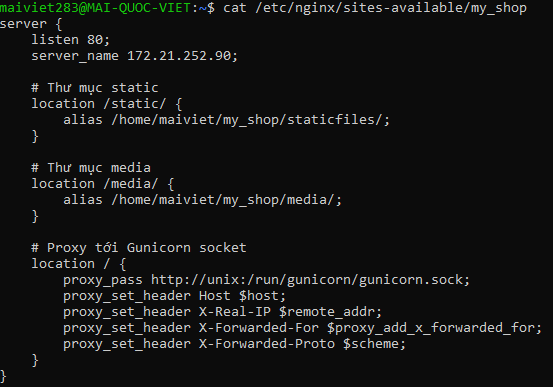

Ok, mình sẽ giải thích chi tiết **file config Nginx** này của bạn. Đây là phần quan trọng để **Nginx phục vụ static + media và proxy request tới Gunicorn**.

---


## **1️⃣ server block**

```nginx
server {
    listen 80;
    server_name 172.21.252.90;
```

* `listen 80`: Nginx sẽ lắng nghe **HTTP port 80**.
* `server_name 172.21.252.90`: server này sẽ phục vụ request tới IP 172.21.252.90.

  * Nếu bạn có domain, thay bằng domain ví dụ: `myshop.com www.myshop.com`.

---

## **2️⃣ Thư mục static**

```nginx
location /static/ {
    alias /home/maiviet/my_shop/staticfiles/;
}
```

* Khi browser request URL bắt đầu `/static/` (ví dụ `/static/home/css/style.css`) → Nginx sẽ **truy cập thư mục `staticfiles/` trên server**.
* `alias` ở đây nói Nginx: “URL `/static/...` tương ứng với đường dẫn file `/home/maiviet/my_shop/staticfiles/...`”.

> Lưu ý: bạn phải chạy `python manage.py collectstatic` trước để copy toàn bộ CSS/JS/images vào `staticfiles/`.

---

## **3️⃣ Thư mục media**

```nginx
location /media/ {
    alias /home/maiviet/my_shop/media/;
}
```

* Tương tự static, nhưng cho **media user upload** (hình ảnh, file).
* `/media/...` trên web → trỏ tới `/home/maiviet/my_shop/media/...` trên server.

---

## **4️⃣ Proxy tới Gunicorn**

```nginx
location / {
    proxy_pass http://unix:/run/gunicorn/gunicorn.sock;
    proxy_set_header Host $host;
    proxy_set_header X-Real-IP $remote_addr;
    proxy_set_header X-Forwarded-For $proxy_add_x_forwarded_for;
    proxy_set_header X-Forwarded-Proto $scheme;
}
```

### Chi tiết:

1. `proxy_pass http://unix:/run/gunicorn/gunicorn.sock;`

   * Nginx sẽ **gửi tất cả request còn lại** tới **Gunicorn** qua Unix socket.
   * Không dùng port TCP, Unix socket **nhanh hơn và an toàn hơn**.

2. `proxy_set_header Host $host;`

   * Truyền tên host gốc tới Django.
   * Django dùng để tạo URL tuyệt đối hoặc check `ALLOWED_HOSTS`.

3. `proxy_set_header X-Real-IP $remote_addr;`

   * Gửi địa chỉ IP client thật tới Django.

4. `proxy_set_header X-Forwarded-For $proxy_add_x_forwarded_for;`

   * Lưu danh sách IP client qua các proxy.

5. `proxy_set_header X-Forwarded-Proto $scheme;`

   * Cho Django biết request có dùng HTTPS hay HTTP.

---

## **5️⃣ Workflow tổng quát**

1. Browser request → Nginx.
2. Nếu `/static/` hoặc `/media/` → Nginx phục vụ trực tiếp từ disk.
3. Các request khác → Nginx proxy tới Gunicorn qua socket.
4. Gunicorn gọi Django WSGI → Django trả response → Nginx gửi lại browser.

---

✅ Nhờ cách này:

* Static files **load nhanh**, không qua Gunicorn → tiết kiệm resource.
* Gunicorn chỉ lo request động → xử lý hiệu quả.
* Có thể dùng nhiều worker Gunicorn để tăng concurrency.

---

Nếu muốn, mình có thể vẽ sơ đồ trực quan **Browser → Nginx → Gunicorn → Django → DB / Static / Media** để bạn hình dung toàn bộ flow production.

Bạn có muốn mình vẽ sơ đồ đó không?
